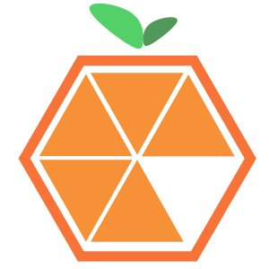
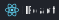
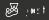

<section align="center">
 
## Acerca de mí (About) :blush:

 

🚀  Desarrollador de Software con <b>7 años</b> de experiencia
 
:sparkling_heart: Consultor de Programación

🌍 Fundador de la Comunidad: **[@3en1developers](https://github.com/3en1developers)**

:computer: Fundador de la Empresa: **[@tizanasoft](https://github.com/tizanasoft)**
 

</section>

<section align="center">

## Tecnologías (Skills) 🛠️

### Frontend

 
 
  

 

 
 
 

 

  

  
  
   

</section>

<section align="center">
 
### Backend

 
  

 

  

  

  

  

  

  

  

  

</section>

<section align="center">

### Database

  

    
    
    
    
    
    
  

</section>

<!-- 
<section align="center">

### Mobile

  

    
    
  

</section> -->

<section align="center">

### Desing

  

    
  

</section>

<section align="center">

## Proyectos (Projects) ❤️

0️⃣ [Mi Blog](https://github.com/achique-luisdan/blog.achique.luisdan)

1️⃣ [Farmatodo - Portal de Aplicaciones Corporativas](https://github.com/achique-luisdan/farmatodo-portal-aplicaciones-corporativas)
 
2️⃣ [Farmatodo - Etiquetado Web](https://github.com/achique-luisdan/farmatodo-etiquetado-web)

3️⃣ [Farmatodo - Sistema de Inventario Activo](https://github.com/achique-luisdan/farmatodo-sistema-inventario-activo)
 
4️⃣ [Julio Masajes - Landing Page](https://github.com/achique-luisdan/web-julio-masajes) 

5️⃣ [Konekti Media - Ruleta de Premios]() 

6️⃣ [Konekti Media - Web de Demos Publicitarios]()

7️⃣ [Web Coffee Domestika](https://github.com/achique-luisdan/web-coffee-domestika)
 
8️⃣ [Web Cakes Shop](https://github.com/achique-luisdan/web-cakes-shop)

9️⃣ [Web Linker Instagram](https://github.com/achique-luisdan/web-linker-instagram)
 
1️⃣0️⃣ [Video Player](https://github.com/achique-luisdan/video-player)

1️⃣1️⃣ [Enciclopedia Multimedia "Aurora Digital"](https://github.com/achique-luisdan/em-aurora-digital)

1️⃣2️⃣ [Sistema Tutor Inteligente "Aurora Digital"](https://github.com/achique-luisdan/sti-aurora-digital)
 
</section>

<section align="center">

## Cursos Aprobados (Cources) :bookmark_tabs:

:large_blue_circle: [Teórico de Frontend Developer](https://platzi.com/p/achiqueluisdan/curso/2467-frontend-developer/diploma/detalle/)
	
:large_blue_circle: [Práctico de Frontend Developer](https://platzi.com/p/achiqueluisdan/curso/2477-frontend-developer-practico/diploma/detalle/)

:large_blue_circle: [Conseguir Trabajo como Frontend Developer](https://platzi.com/p/achiqueluisdan/curso/2641-conseguir-trabajo-frontend/diploma/detalle/)

:large_blue_circle: [Práctico de HTML y CSS](https://platzi.com/p/achiqueluisdan/curso/1758-html-practico/diploma/detalle/)

:large_blue_circle: [Práctico de Maquetación en CSS](https://platzi.com/p/achiqueluisdan/curso/1744-practico-css/diploma/detalle/)

:large_blue_circle: [CSS Grid Básico](https://platzi.com/p/achiqueluisdan/curso/2474-css-grid/diploma/detalle/)

:large_blue_circle: [Básico de JavaScript](https://platzi.com/p/achiqueluisdan/curso/1814-basico-javascript/diploma/detalle/)

:large_blue_circle: [Práctico de JavaScript](https://platzi.com/p/achiqueluisdan/curso/2327-javascript-practico-2021/diploma/detalle/)

:large_blue_circle: [Manipulación de Arrays en JavaScript](https://platzi.com/p/achiqueluisdan/curso/2461-arrays/diploma/detalle/)

:large_blue_circle: [Práctico de JavaScript: Matemáticas y Estadística Básica](https://platzi.com/p/achiqueluisdan/curso/3435-javascript-practico-matematicas/diploma/detalle/)

:large_blue_circle: [Angular: Fundamentos](https://platzi.com/p/achiqueluisdan/curso/2478-angular/diploma/detalle/)
	
:large_blue_circle: [Angular: Componentes y Servicios](https://platzi.com/p/achiqueluisdan/curso/2486-angular-componentes/diploma/detalle/)
	
:large_blue_circle: [Angular: CDK y Tailwind CSS](https://platzi.com/p/achiqueluisdan/curso/4459-angular-tailwind/diploma/detalle/)

:large_blue_circle: [Vue.js: Introducción y Fundamentos](https://platzi.com/p/achiqueluisdan/curso/2819-vuejs/diploma/detalle/)
	
:large_blue_circle: [Vue.js: Componentes y Composition API](https://platzi.com/p/achiqueluisdan/curso/2820-vuejs-componentes-composition/diploma/detalle/)
	
:large_blue_circle: [Audiocurso de Frameworks y Arquitecturas Frontend: Casos de Estudio](https://platzi.com/p/achiqueluisdan/curso/4623-arquitectura-frontend/diploma/detalle/)

:large_blue_circle: [Diseño para Developers](https://platzi.com/p/achiqueluisdan/curso/1906-diseno-programadores/diploma/detalle/)

:large_blue_circle: [Audiocurso Glosario de Términos de Diseño](https://platzi.com/p/achiqueluisdan/curso/2475-glosario-ux/diploma/detalle/)

:large_blue_circle: [Responsive Design: Maquetación Mobile First](https://platzi.com/p/achiqueluisdan/curso/2030-mobile-first/diploma/detalle/)

:large_blue_circle: [Aprender a Ser Creativo](https://platzi.com/p/achiqueluisdan/curso/3097-aprendercreatividad/diploma/detalle/)

:large_blue_circle: [Crear un Brief](https://platzi.com/p/achiqueluisdan/curso/3160-brief-marketing/diploma/detalle/)

:large_blue_circle: [Básico de Escritura Creativa](https://platzi.com/p/achiqueluisdan/curso/2781-escritura-basica/diploma/detalle/)

:large_blue_circle: [Backend con Node.js: API REST con Express.js](https://platzi.com/p/achiqueluisdan/curso/2485-backend-nodejs/diploma/detalle/)

:large_blue_circle: [Básico de Python](https://platzi.com/p/achiqueluisdan/curso/1937-python-basico/diploma/detalle/)
	
:large_blue_circle: [Básico de Django](https://platzi.com/p/achiqueluisdan/curso/2694-django/diploma/detalle/)

:large_blue_circle: [Django Intermedio: Testing, Static Files, Django Admin](https://platzi.com/p/achiqueluisdan/curso/2728-django-intermedio/diploma/detalle/)

:large_blue_circle: [Organizar tu Vida con Bullet Journal](https://platzi.com/p/achiqueluisdan/curso/3094-bullet-journal/diploma/detalle/)
	
### Sobre Blogging

:large_blue_circle: [Marca Personal: Creación de Blog](https://platzi.com/p/achiqueluisdan/curso/2593-blog-personal/diploma/detalle/)

:large_blue_circle: [Marketing de Contenidos para Marca Personal](https://platzi.com/p/achiqueluisdan/curso/3228-contenidosmarcapersonal/diploma/detalle/)

:large_blue_circle: [Hacks para Redactar Titulares](https://platzi.com/p/achiqueluisdan/curso/3040-titulares/diploma/detalle/)

	
## Agradecimientos (Thanks) 🎁

Artículo para crear un README
[midudev](https://midu.dev/como-crear-tu-perfil-de-github-con-readme/)
</section>
