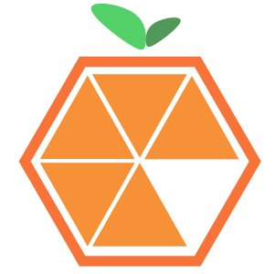

<section align="center">
 
## Acerca de mí :blush:

 

 
  :iphone: Desarrollador de Software

  :sparkling_heart: Consultor de Programación
 
 :computer: Fundador de la Empresa: **[@tizanasoft](https://github.com/tizanasoft)**
 

</section>

<section align="center">

### Tecnologías

### Frontend

 
 
  

 

 
 
 

 
  

</section>

<section align="center">
 
### Backend

 
  

 

 

 
</section>

<section align="center">

## Proyectos (Projects) ❤️
 
1️⃣ [Farmatodo - Portal de Aplicaciones Corporativas](https://github.com/achique-luisdan/farmatodo-portal-aplicaciones-corporativas)
 
2️⃣ [Farmatodo - Etiquetado Web](https://github.com/achique-luisdan/farmatodo-etiquetado-web)

3️⃣ [Farmatodo - Sistema de Inventario Activo](https://github.com/achique-luisdan/farmatodo-sistema-inventario-activo)
 
4️⃣ [Web Coffee Domestika](https://github.com/achique-luisdan/web-coffee-domestika)
 
5️⃣ [Web Cakes Shop](https://github.com/achique-luisdan/web-cake-shop)
	
6️⃣ [Web Linker Instagram](https://github.com/achique-luisdan/web-linker-instagram)
 
7️⃣ [Video Player](https://github.com/achique-luisdan/video-player)

8️⃣ [Enciclopedia Multimedia "Aurora Digital"](https://github.com/achique-luisdan/em-aurora-digital)

:nine: _ [Sistema Tutor Inteligente "Aurora Digital"](https://github.com/achique-luisdan/sti-aurora-digital)
 
</section>

<section align="center">
 

 
 
## Agradecimientos 🎁

Artículo para Crear un README
[midudev](https://midu.dev/como-crear-tu-perfil-de-github-con-readme/)
</section>
