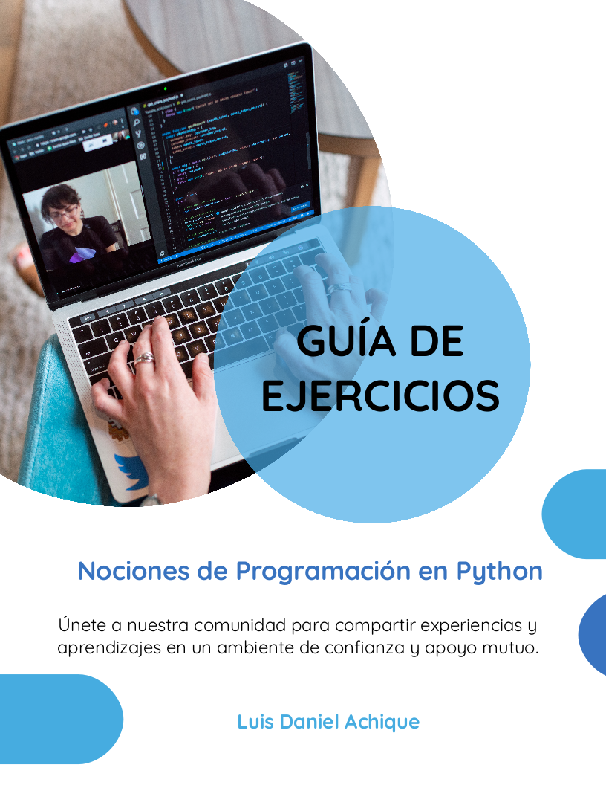
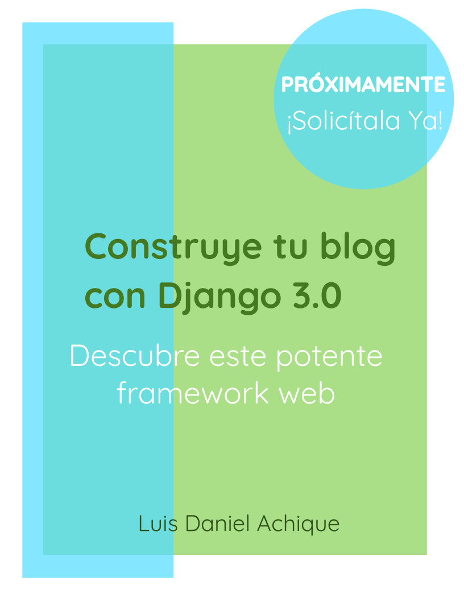
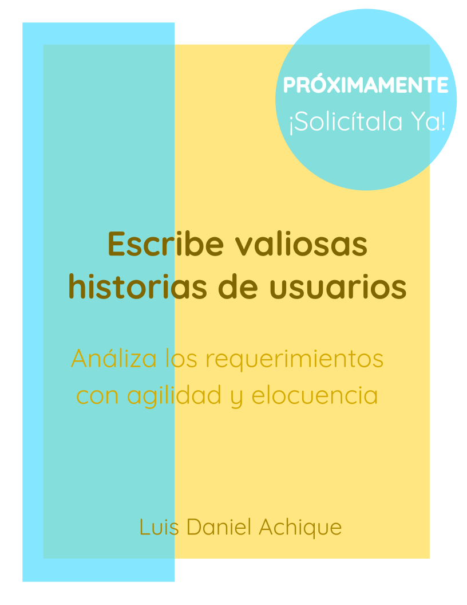
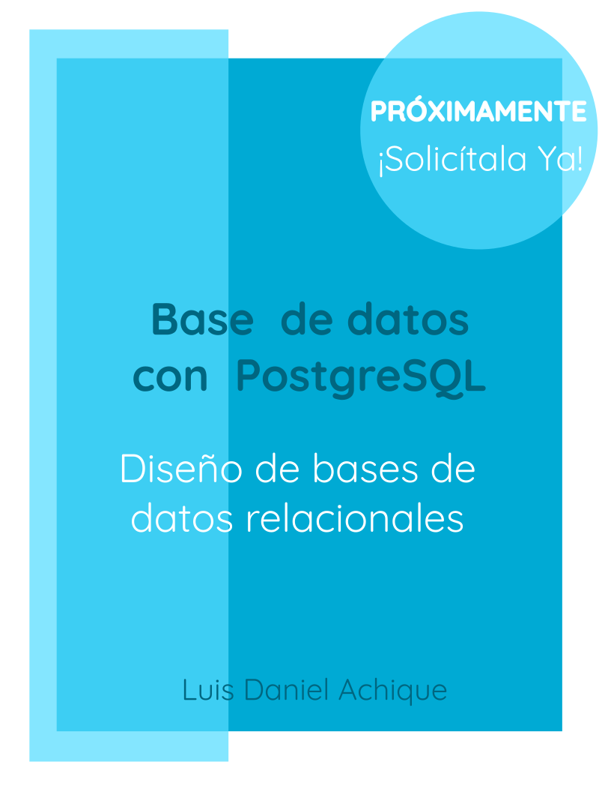

<section align="center">
 
## Hola, Hola :blush:

## Acerca de mí

 
 :iphone: Desarrollador de Software

 :sparkling_heart: Creador de Contenidos Educativos
 
 :computer: Fundador de la Empresa: **@tizanasoft**
 
 :bookmark_tabs: Escritor de E-Books
 

</section>

<section align="center">

### Tecnologías

### Frontend

 

 

 

 

 
  

</section>

<section align="center">
 
#### Backend

 
  

 

 

 
</section>

<section align="center">
 
## E-Books

 
</section>

<section align="center">
 
## Blogs

</section>

<section align="center">

## YouTube

[Tizana Coding](https://www.youtube.com/channel/UCukcjedjyv1hgQB8OMBEYeQ) 
  
 Vlog de Desarrollo Web
 
 
</section>

#### ***Agradecimientos***

Plantilla de README [8bithemant](https://github.com/8bithemant)

Artículo para Crear un README
[midudev](https://midu.dev/como-crear-tu-perfil-de-github-con-readme/)
